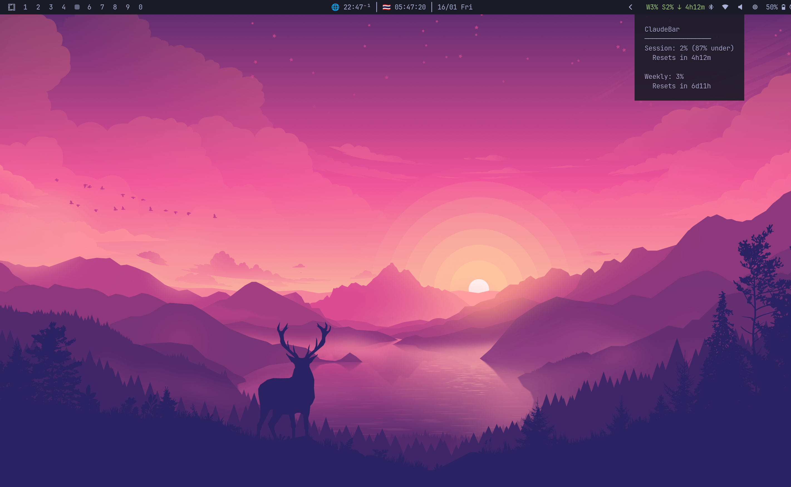
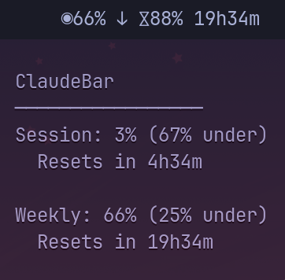

# ClaudexBar

Waybar usage module for Claude + Codex with one click-to-toggle provider.



<p align="center">
  
</p>

## What it does

- Shows usage in Waybar (`text`, `tooltip`, `class`).
- Supports providers:
  - `codex` (OAuth API with RPC fallback)
  - `claude` (Anthropic OAuth usage API)
- Prefixes provider badge in bar text:
  - `A` for Claude
  - `O` for Codex

## Commands

```bash
claudex                  # render payload for current provider
claudex --toggle         # toggle provider: codex <-> claude
claudex --provider claude
claudex --provider codex

cdx                      # interactive menu (from ~/.bashrc.d/claudexbar)
cdxraw                   # raw JSON output
```

## Bash Integration

If you use `~/.bashrc.d`, create `~/.bashrc.d/claudexbar`:

```bash
claudex() {
  ~/.bun/bin/bun ~/.local/bin/claudexbar.ts "$@"
}

cdxraw() {
  claudex "$@"
}

cdxmenu() {
  local state_dir="$HOME/.codex/claudexbar"
  mkdir -p "$state_dir"
  while true; do
    local provider
    provider="$(cat "$state_dir/provider" 2>/dev/null || echo codex)"
    echo ""
    echo "Claudex Menu"
    echo "────────────"
    echo "provider: $provider"
    echo "1) toggle provider"
    echo "2) provider -> claude"
    echo "3) provider -> codex"
    echo "q) quit"
    read -rp "Select: " choice
    case "$choice" in
      1) claudex --toggle ;;
      2) claudex --provider claude ;;
      3) claudex --provider codex ;;
      q|Q) break ;;
      *) echo "Invalid choice" ;;
    esac
  done
}

cdx() {
  if [[ $# -eq 0 ]]; then
    cdxmenu
    return
  fi
  claudex "$@"
}
```

Make sure your `~/.bashrc` sources `~/.bashrc.d/*`:

```bash
for file in ~/.bashrc.d/*; do
  [[ -f "$file" ]] && source "$file"
done
```

Optional: if you use `buomarchy`, sync ClaudexBar into both backup and repo paths:

```bash
cp "$HOME/.local/bin/claudexbar.ts" "$HOME/omarchy-sync/scripts/claudexbar.ts"
cp "$HOME/.local/bin/claudexbar.ts" "$HOME/Code/claudexbar/claudexbar.ts"
```

If your repo folder uses different casing, set it explicitly:

```bash
export CLAUDEXBAR_REPO_DIR="$HOME/Code/claudexbar"
```

## Waybar snippet

```jsonc
"custom/claudexbar": {
  "exec": "~/.bun/bin/bun ~/.local/bin/claudexbar.ts",
  "interval": 60,
  "return-type": "json",
  "tooltip": true,
  "signal": 11,
  "on-click": "~/.bun/bin/bun ~/.local/bin/claudexbar.ts --toggle && pkill -RTMIN+11 waybar"
}
```

## State files

- `~/.codex/claudexbar/provider`

## Requirements

- Bun installed (`~/.bun/bin/bun` in snippets above).
- Waybar with `custom/claudexbar` module enabled.
- Logged in CLIs:
  - `codex login`
  - `claude` (for Claude provider usage)

## Security

- No machine-specific secrets are stored in this repo.
- Runtime auth is read from local CLI credential files (`~/.codex/auth.json`, `~/.claude/.credentials.json`), which are not tracked in git.
