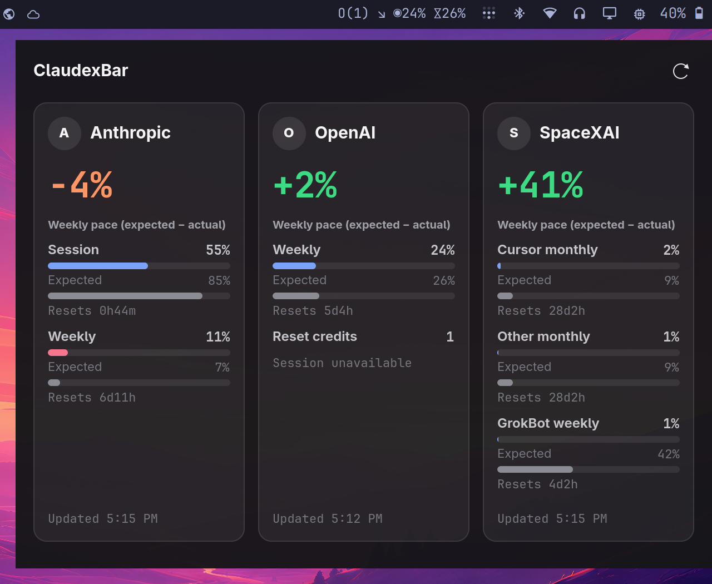

# ClaudexBar

> [!IMPORTANT]
> **ClaudexBar works on both macOS and Linux.** Run the same `./install.sh` command and it automatically installs the correct version for your operating system.

| Platform | What gets installed |
| --- | --- |
| **macOS** | Native SwiftUI menu-bar app at `/Applications/ClaudexBar.app` |
| **Linux** | Shared engine and GTK dashboard under `~/.local/bin`, used by an Omarchy Quattro command widget or optional Waybar integration |

Both versions show the same Codex, Claude, and SpaceXAI (Grok) subscription limits in matching three-card dashboards. One shared TypeScript engine owns authentication, quota fetching, pacing, reset countdowns, caching, and fallbacks; each platform keeps a thin native desktop adapter.

### macOS menu-bar app


The native macOS dropdown shows OpenAI (Codex), Anthropic (Claude), and SpaceXAI (Grok) simultaneously in three compact columns. Each column keeps its quota bars, reset countdowns, provider-specific details, and refresh time. The menu bar shows every provider's signed weekly pace at a glance.

## Features

- Matching three-card Anthropic, OpenAI, and SpaceXAI dashboards on macOS and Linux.
- Paired actual and expected progress bars with reset countdowns for session and weekly windows; SpaceXAI shows Cursor Models (Monthly), Other Models (Monthly), and GrokBot (Weekly).
- Signed weekly pace is `expected − actual`: negative means quota consumption is ahead of its linear allowance.
- Disconnected providers show a **Reconnect** button in their dashboard column; the macOS menu-bar summary omits them until they reconnect.
- OpenAI free reset-credit count in both dashboards and the Linux tooltip.
- Five-minute refresh, manual refresh, caching, and rate-limit backoff.
- Subtle per-provider last-updated time in both dashboards and the Linux tooltip.
- Native macOS launch-at-login control.
- Native monochrome macOS menu-bar summary.
- Automatic macOS/Linux installer routing.

## Display

The macOS menu bar shows all weekly pace values:

```text
A -1%  O +4%  S +39%
```

| Part | Meaning |
| --- | --- |
| `A` / `O` / `S` | Anthropic Claude / OpenAI Codex / SpaceXAI Grok |
| Signed percentage | Expected weekly consumption minus actual weekly consumption |
| Negative pace | Actual consumption is ahead of the linear allowance |
| Positive pace | Actual consumption is below the linear allowance |
| `--` | Weekly pace is unavailable for that provider |

The macOS popover and Linux dashboard both show all three providers in fixed Anthropic, OpenAI, SpaceXAI order. Each compact column retains the provider's available session, weekly, monthly, reset-credit, authentication, and refresh details. Actual and expected bars remain separate so the signed pace can be checked visually.

Linux retains its compact selectable bar display:

```text
O(1) → ◉1% ⧖1%
```

`◉` is quota consumed, `⧖` is elapsed window time, and the arrow expresses the existing relative pacing severity. Hover shows the compact tooltip; click opens the matching three-card dashboard. The actual bar turns cosmic orange when usage is over expected and red when it is at least 10% over pace.

Window lengths differ by provider. Codex reports its own window length. Claude's weekly window is seven days and resets on the account's assigned weekly schedule. SpaceXAI combines Cursor's monthly model buckets with Grok's weekly percentage and next reset time. See [docs/ARCHITECTURE.md](docs/ARCHITECTURE.md) for how each provider supplies this.

## Install

Clone the repository and run the same installer on either platform:

```sh
git clone https://github.com/andresreibel/ClaudexBar.git
cd ClaudexBar
./install.sh
```

The installer uses `uname`:

- macOS builds and installs `/Applications/ClaudexBar.app`.
- Linux installs `~/.local/bin/claudexbar.ts`.

### macOS

Requirements:

- macOS 14 or newer.
- Xcode Command Line Tools / Swift.
- Bun.
- `librsvg` for the app icon build.

```sh
xcode-select --install  # only when Swift is missing
brew install bun librsvg
./install.sh
open /Applications/ClaudexBar.app
```

The app is currently built from source and ad-hoc signed. There is no notarized downloadable build yet.

### Linux

Requirements:

- Python 3, GTK 4, and PyGObject.
- `gtk4-layer-shell` is recommended on Wayland so the dashboard opens as a top-right popover; without it, ClaudexBar uses a normal GTK window.



`./install.sh` installs the shared engine and `~/.local/bin/claudexbar-dashboard`. On Omarchy Quattro, add them as a command widget in `~/.config/omarchy/shell.json`:

```json
{
  "id": "claudexbar",
  "type": "command",
  "exec": "~/.bun/bin/bun ~/.local/bin/claudexbar.ts",
  "interval": 1,
  "onClick": "~/.local/bin/claudexbar-dashboard"
}
```

The one-second bar interval reads the local render cache; live usage requests remain limited to about once per five minutes. Hover for compact details and click to open or close the three-card dashboard. A loading spinner holds the cards back until the aggregate provider payload is ready; the refresh button then updates every provider together. This uses Quattro's built-in command widget—no custom QML or plugin is required.

### Optional Waybar integration


For a non-Omarchy Waybar setup, add the shell and Waybar integrations:

```sh
./install.sh --all
```

Or install integrations separately:

```sh
./install.sh --bashrc
./install.sh --waybar
```

Commands:

```sh
claudexbar-dashboard
claudex
claudex --toggle
claudex --provider claude
claudex --provider codex
claudex --provider grok
claudex --login grok
```

## Authentication and state

ClaudexBar keeps credentials outside the repository and application bundle. It reuses existing Codex and Claude CLI credentials and stores its own Grok sign-in:

- Codex: `~/.codex/auth.json`.
- Claude on Linux: `~/.claude/.credentials.json`.
- Claude on macOS: the credentials file when present, otherwise the `Claude Code-credentials` Keychain item.
- SpaceXAI: `~/.codex/claudexbar/grok-auth.json`, created with mode `0600` only after the explicit **Reconnect** action.
- Linux provider selection and per-provider caches: `~/.codex/claudexbar/`.

The shared engine may refresh existing Codex or Claude OAuth credentials when required. SpaceXAI uses its own explicit PKCE sign-in and never opens a browser during normal refresh. On macOS, disconnected providers leave the menu-bar summary and show **Reconnect** in their column; authenticated and unrelated error states show no reconnect button. Some Anthropic organizations reject the OAuth usage endpoint with `403`; see [troubleshooting](docs/TROUBLESHOOTING.md).

## Development

```sh
make test
make app
make install
open /Applications/ClaudexBar.app
```

Verification covers Swift payload decoding, macOS presentation, Keychain decoding, TypeScript compilation, packaging, and the installed bundle.

See [architecture](docs/ARCHITECTURE.md), [troubleshooting](docs/TROUBLESHOOTING.md), and the [changelog](CHANGELOG.md).

## Current verification

- macOS native app: built, installed, signed, launched, and live Codex usage verified.
- Codex free reset credits: verified against `rate_limit_reset_credits.available_count`.
- Claude macOS Keychain discovery: verified.
- SpaceXAI login and live Cursor-backed Grok weekly usage: verified in the installed macOS app.
- Claude live usage: account-dependent; the current OAuth endpoint can reject organization-managed accounts.
- Linux: Quattro command-widget and optional Waybar paths use the same shared engine; CI validates the engine and installer syntax.

## License

See [LICENSE](LICENSE).
