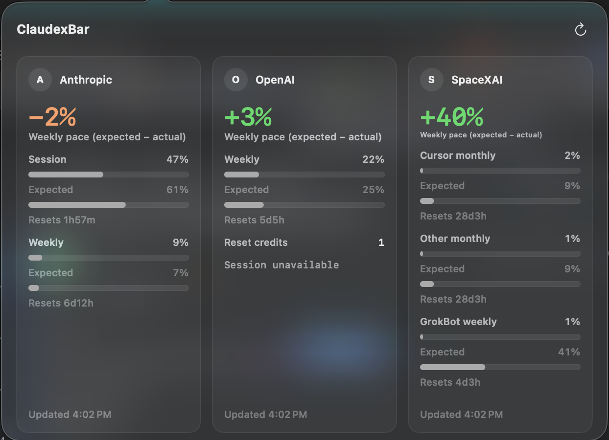

# ClaudexBar

> [!IMPORTANT]
> **ClaudexBar works on both macOS and Linux.** Run the same `./install.sh` command and it automatically installs the correct version for your operating system.

| Platform | What gets installed |
| --- | --- |
| **macOS** | Native SwiftUI menu-bar app at `/Applications/ClaudexBar.app` |
| **Linux** | Shared engine at `~/.local/bin/claudexbar.ts`, used by an Omarchy Quattro command widget or optional Waybar integration |

Both versions show the same Codex and Claude subscription limits. One shared TypeScript engine owns authentication, quota fetching, pacing, reset countdowns, caching, and fallbacks; only the desktop interface differs.

### macOS menu-bar app



The native macOS dropdown shows OpenAI (Codex) or Anthropic (Claude) session and weekly usage, reset countdowns, available OpenAI reset credits, and the most recent refresh time. The menu-bar summary stays visible while you work.

## Features

- Stable OpenAI and Anthropic switching: selection updates immediately while the dropdown and menu-bar anchor remain stationary during loading.
- Compact session and week utilization rows with reset countdowns.
- Warning or critical labels only on the quota window that triggered them.
- OpenAI free reset-credit count in the menu bar and macOS dropdown.
- Five-minute refresh, manual refresh, caching, and rate-limit backoff.
- Subtle last-updated time in the macOS dropdown and Linux tooltip.
- Native macOS launch-at-login control.
- Native monochrome macOS menu-bar summary.
- Automatic macOS/Linux installer routing.

## Display

Example:

```text
O(1) → ◉1% ⧖1%
```

| Part | Meaning |
| --- | --- |
| `O` / `A` | OpenAI Codex / Anthropic Claude |
| `(1)` | Available Codex free reset credits |
| `↑ ↗ → ↘ ↓` | Rounded pace delta: vertical at 10% or more, diagonal from 1% to 9%, horizontal at 0%; up is ahead and down is under |
| `◉1%` | Weekly budget used |
| `⧖1%` | Weekly window time elapsed |
| Detail view | Compact session and week reset countdowns, plus warning or critical on the affected row |

The menu bar summarizes the weekly window; session usage and reset countdowns stay in the detail view.
Normal quota rows omit pacing prose such as `on track`, `under`, or `ahead`.
On macOS, the dropdown remains 390 × 350 points while provider usage loads.

Read `◉` and `⧖` as a pair. `◉` is how much budget you have spent, `⧖` is how much of the window has passed, and the arrow compares them. `◉0% ⧖5%` means the window is 5% gone and you have spent nothing, so you are well under pace. When `◉` runs ahead of `⧖`, you are on track to exhaust the budget before the window resets.

The macOS menu-bar summary uses the standard adaptive system label color. Linux Waybar keeps its status colors: orange means more than 5% ahead of pace or at least 75% of the weekly budget used; red means more than 10% ahead of pace or at least 90% used.

Window lengths differ by provider. Codex reports its own window length. Claude's weekly window is seven days and resets on the account's assigned weekly schedule. See [docs/ARCHITECTURE.md](docs/ARCHITECTURE.md) for how each provider supplies this.

## Install

Clone the repository and run the same installer on either platform:

```sh
git clone https://github.com/andresreibel/ClaudexBar.git
cd ClaudexBar
./install.sh
```

The installer uses `uname`:

- macOS builds and installs `/Applications/ClaudexBar.app`.
- Linux installs `~/.local/bin/claudexbar.ts`.

### macOS

Requirements:

- macOS 14 or newer.
- Xcode Command Line Tools / Swift.
- Bun.
- `librsvg` for the app icon build.

```sh
xcode-select --install  # only when Swift is missing
brew install bun librsvg
./install.sh
open /Applications/ClaudexBar.app
```

The app is currently built from source and ad-hoc signed. There is no notarized downloadable build yet.

### Linux

`./install.sh` installs the shared engine. On Omarchy Quattro, add it as a command widget in `~/.config/omarchy/shell.json`:

```json
{
  "id": "claudexbar",
  "type": "command",
  "exec": "~/.bun/bin/bun ~/.local/bin/claudexbar.ts",
  "interval": 1,
  "onClick": "~/.bun/bin/bun ~/.local/bin/claudexbar.ts --toggle"
}
```

The one-second bar interval reads the local render cache; live usage requests remain limited to about once per five minutes. Click to switch providers and hover for compact session, weekly, reset, and refresh details. This uses Quattro's built-in command widget—no custom QML or plugin is required.

### Optional Waybar integration


For a non-Omarchy Waybar setup, add the shell and Waybar integrations:

```sh
./install.sh --all
```

Or install integrations separately:

```sh
./install.sh --bashrc
./install.sh --waybar
```

Commands:

```sh
claudex
claudex --toggle
claudex --provider claude
claudex --provider codex
```

## Authentication and state

ClaudexBar reuses existing CLI credentials; it never stores credentials in the repository or application bundle.

- Codex: `~/.codex/auth.json`.
- Claude on Linux: `~/.claude/.credentials.json`.
- Claude on macOS: the credentials file when present, otherwise the `Claude Code-credentials` Keychain item.
- Provider selection and caches: `~/.codex/claudexbar/`.

The shared engine may refresh existing OAuth credentials when required. Some Anthropic organizations reject the OAuth usage endpoint with `403`; see [troubleshooting](docs/TROUBLESHOOTING.md).

## Development

```sh
make test
make app
make install
open /Applications/ClaudexBar.app
```

Verification covers Swift payload decoding, macOS presentation, Keychain decoding, TypeScript compilation, packaging, and the installed bundle.

See [architecture](docs/ARCHITECTURE.md), [troubleshooting](docs/TROUBLESHOOTING.md), and the [changelog](CHANGELOG.md).

## Current verification

- macOS native app: built, installed, signed, launched, and live Codex usage verified.
- Codex free reset credits: verified against `rate_limit_reset_credits.available_count`.
- Claude macOS Keychain discovery: verified.
- Claude live usage: account-dependent; the current OAuth endpoint can reject organization-managed accounts.
- Linux: Quattro command-widget and optional Waybar paths use the same shared engine; CI validates the engine and installer syntax.

## License

See [LICENSE](LICENSE).
